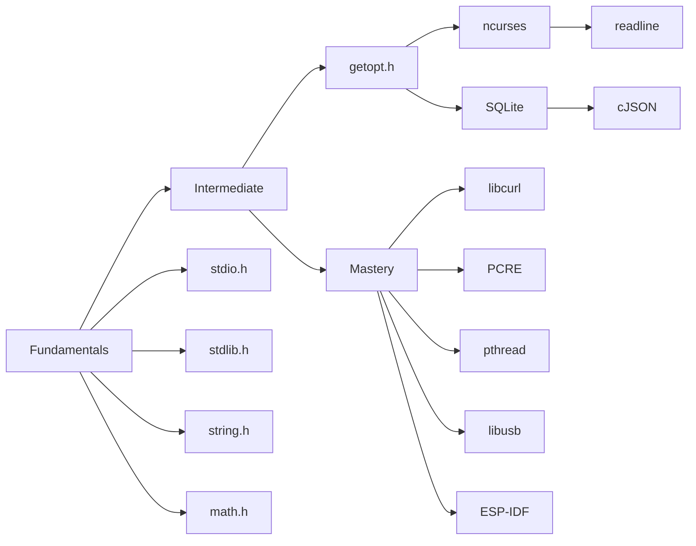

# Prerequisite
- what are programming languages 
- what are compilers
- CGG/CLANG
- NINJA/CMAKE

# C Fundamentals

## course
### 1.
- **syntax** 
- **variable** 
- **data types**
- **operations**
- **scanf** / **printf**
### 2. 
- **if** **else** 
- **for** 
- **while** 
- **do-while**
- **switch-case**

- lib

## Project
???

GPT:
- Take inputs: student names, IDs, grades.
- Calculate and display averages, pass/fail counts.
- Implement basic menus using `switch-case`.
- Practice loops, conditions, I/O clearly

# C Intermediate

## course

### 1.
- **Arrays** (1D)
- **String manipulation**
- **Pointer basics**

### 2. 
 - **Arrays** (2D)
 - **pointer to pointer** 
 - **Array of strings** 

### 3. 
 - **Structs**
- **Typedef**,
- **Enums**

### 4.
- **pointer to function**
- **Union vs. Struct** (quick intro)
-  **nested structs**
### 5. 
- **multi-file structure**
- **STDIN**/**STDOUT**
- **Static keyword**

## Project

# C Mastery

## course

- <**stdint.h**>
	- Fixed-width integer types: `u_intx_t`\ `intx_t`
	- Minimum-width integer types: `int_least8_t`
	- Fastest integer types: `int_fast8_t`
	- Pointer-Capable Integer Types: 
		- `intptr_t`
		- `uintptr_t`
	- other
		- `size_t` 
		- `ptrdiff_t`
		- `void*`
- **ESP fundamentals**
- **CLI Libraries** **ncurses (PDCurses for Windows)**
- **GUI**?
- **Multi-Threading**
- **forking process**

## Project

# others

1. **Memory Management**:
    
    - Stack vs. Heap, memory leaks, `valgrind` basics
        
2. **Advanced Pointers**:
    
    - Function pointers (for callbacks), `void*`, pointer arithmetic
        
3. **Error Handling**:
    
    - Return codes vs. `errno`, defensive programming
        
4. **Performance Basics**:
    
    - Algorithm complexity (O-notation intro), cache locality

